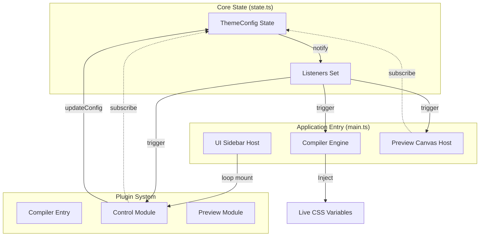
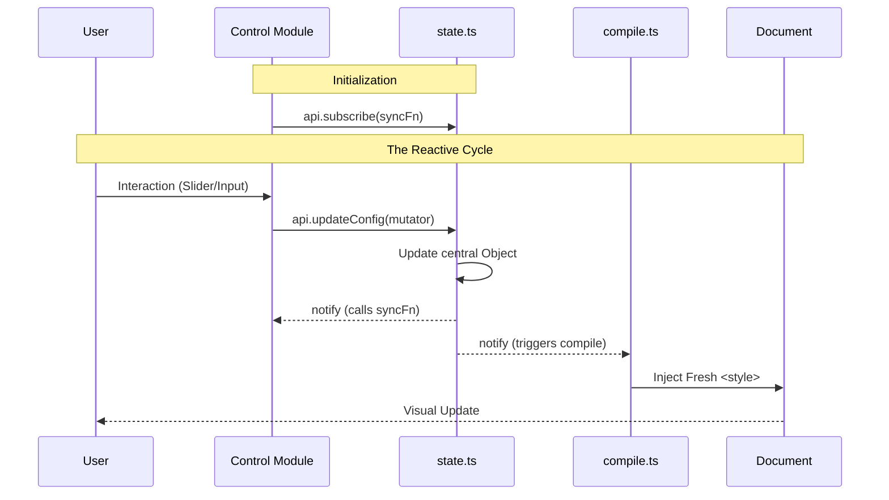

# CSS Theme Builder v0.1.0

A high-performance, plugin-based engine for generating modern design systems. This tool allows designers and developers to build, audit, and export CSS design tokens and utility classes through a visual interface.

## 🎯 Goal

The goal of this project is to bridge the gap between design variables and production CSS. It provides a "live" environment where design foundations (colors, typography, spacing, etc.) can be tailored per theme persona and instantly exported as a clean, standardized CSS system.

## 🚀 Tech Stack

- **Engine**: Pure TypeScript (zero-framework core)
- **Bundler**: [Vite](https://vitejs.dev/)
- **Styling**: Modern Vanilla CSS with CSS Variables (Custom Properties)
- **Diagrams**: Mermaid.js

### Available Scripts

- `npm install`: Install dependencies.
- `npm run dev`: Start the interactive design environment.
- `npm run build`: Compile the application for production.
- `npm run preview`: Preview the production build locally.

---

## 🏗️ Global Architecture

The application follows a reactive "Single Source of Truth" architecture. When the central `ThemeConfig` changes, the system orchestrates an immediate re-compilation and UI update.

---

## 🔌 Plugin Architecture

The system is entirely modular. Every feature is a self-contained plugin.

### Plugin Contracts

- **Compiler Entry**: Transforms the configuration segment into CSS tokens (`--var`), utilities (`.u-name`), and components.
- **Control Module**: Mounts standard HTML controls into the sidebar for interactive editing.
- **Preview Module**: Renders a dedicated "Spec" or "Gallery" in the main canvas to demonstrate the tokens in action.

### The Reactive Loop (Inner Workings)

1.  **Mounting**: During `main.ts` initialization, every plugin's `mount(container, api)` is called.
2.  **Subscription**: Inside `mount`, most plugins call `api.subscribe(sync)`. This registers a local `sync` function in the global State.
3.  **Interaction**: When a user moves a slider, the plugin calls `api.updateConfig()`.
4.  **Notification**: The State updates the shared object and immediately iterates through all registered listeners.
5.  **Synchronization**:
    - The **Compiler** (via the Preview Engine) re-runs, generating new CSS.
    - All **Control Modules** run their `sync` functions to ensure their inputs match the new global state (crucial for Undo/Redo/Presets).

---

## 🛠️ How to Create a Plugin

1.  **Define the Data**: Extend the `ThemeModules` interface in `src/compiler/types.ts` using TypeScript module augmentation to add your plugin's configuration shape.
2.  **Create Plugin Logic**: Create a new folder in `src/plugins/basic-[your-feature]`.
3.  **Implement Compiler Entry**: Create an object with `emitTokens` and `emitUtilities` functions.
4.  **Build UI Controls**: Implement the `ControlModule` interface, creating a `mount` function that generates the necessary inputs and syncs them with `api.updateConfig`.
5.  **Develop Preview**: Implement the `PreviewModule` to show a visual specification or interactive demo of your feature.
6.  **Register**:
    - Add to `src/compiler/registry.ts`
    - Add to `src/app/ui.ts`
    - Add to `src/app/preview-registry.ts`

---

## ✨ Current Functionality

### Foundations

- **🎨 Color System**: High-precision scale generation (50-950) with Analogous, Complementary, and Manual palette modes.
- **✍️ Typography**: Standardized font scales with fluid line-height foundations.
- **📏 Spacing & Radius**: Unit-based spacing system and semantic rounding tokens.
- **🌑 Shadows**: Multi-layered elevation shadows with granular opacity and blur controls.
- **🥞 Z-Index**: Global stacking order management (`--z-index-*`) for layer-perfect layouts.
- **📐 Iconography**: Standardized icon sizing and stroke-weight foundations.

### Auditing & Handoff

- **♿ Accessibility Audit**: Scans all semantic color pairs for WCAG contrast compliance with one-click "Nudge Fix" capabilities.
- **📋 Style Guide**: A consolidated technical specification of every token in the system.
- **🖱️ Click-to-Copy**: Every token in the Style Guide can be copied as a CSS variable with a single click.
- **📁 Presets**: Pre-configured theme personas (Aurora, Midnight, Cyberpunk, etc.) for instant starting points.
